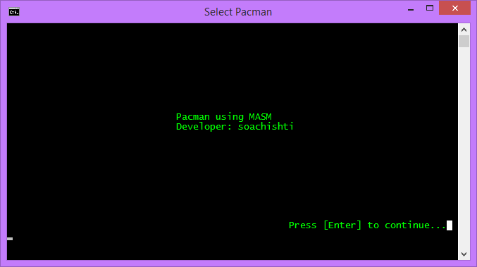
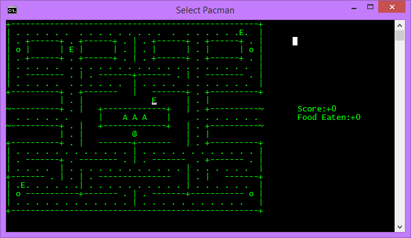
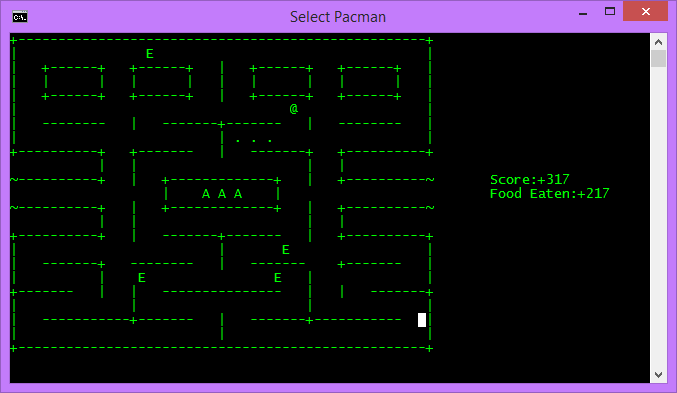
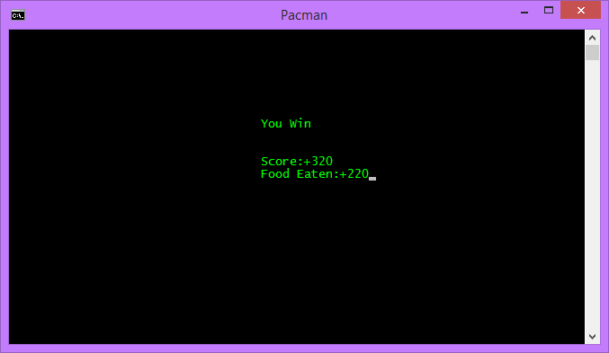
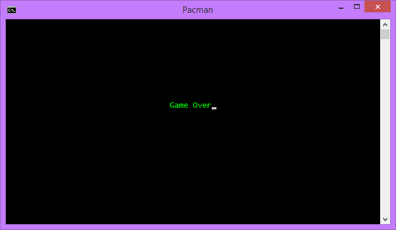

# AsmPacman - Assembly Pacman Game



A fully functional, classic Pacman game written entirely in **x86 Assembly Language (MASM 6.15)**. This project demonstrates low-level programming concepts including screen rendering, character movement, collision detection, and logic handling in assembly.

---

## 🎮 Features
- **Classic Gameplay**: Navigate the maze, eat all the dots, and avoid the enemies!
- **Dynamic Scoring System**: Tracks your score and food eaten in real-time.
- **Enemy AI Logic**: Features multiple enemies with roaming logic and collision detection.
- **Custom Map Layout**: Loaded dynamically from memory with boundaries and collision barriers.
- **Keyboard Controls**: Responsive movement controls tied directly to standard arrow keys.

## ⚙️ Prerequisites
To compile and run this project, you will need:
- **Windows OS**
- **Microsoft Visual Studio 2022** (or other versions with C++ desktop development workload)
- **Irvine32 Library**: The project relies on the Irvine32 library for console I/O.
- **MASM (Microsoft Macro Assembler)**

## 🚀 How to Build and Run
A build script `make32.bat` is included to streamline the compilation process.

1. Clone or download the repository to your local machine.
2. Open your command line or run the batch file directly.
3. Run the following command to assemble and link the code:
   ```cmd
   make32.bat Pacman
   ```
4. If the build is successful, run the generated executable:
   ```cmd
   Pacman.exe
   ```

## 🕹️ Controls
- **Up Arrow**: Move Up
- **Down Arrow**: Move Down
- **Left Arrow**: Move Left
- **Right Arrow**: Move Right

## 📸 Screenshots

| Gameplay | Enemy Tracking |
| :---: | :---: |
|  |  |

| Winning Screen | Game Over |
| :---: | :---: |
|  |  |

*(Note: The map layout was inspired by standard classic layouts available online)*

## 👨‍💻 Developer
Developed by **Abubaker** as a project to demonstrate proficiency in x86 Assembly and low-level computer architecture.
